# The Algebra of Cryptocurrency

Cryptocurrency transactions form a graph that can be represented using Linear Algebra as adjacency and incidence matrices. Interchain links can be represented as incidence matrices that bridge two chains and can project chain-crossing transactions as a single graph for analysis.

This paper introduces an algebraic definition for Bitcoin as a set of sparse matrices. Some matrices connect nodes to similar nodes, an adjacency matrix, and some connect nodes in one set to nodes in another, an incidence matrix.

# Bitcoin

Bitcoin presents a particularly stubborn graph analysis problem: transactions with multiple inputs, outputs, and addresses can be created at will by the network's users forming a very large sparse [Hypergraph](https://en.wikipedia.org/wiki/Hypergraph) bundling previous transaction outputs into new transaction inputs.

The Bitcoin hypergraph is extremely divergent and has a high [Graph Diameter](https://en.wikipedia.org/wiki/Distance_(graph_theory)). As bitcoin is (in a sense) indestructible, value flows forward in time through many transactions on its way from one address to many others, and each transaction along the way can branch into many sub-paths. Starting from one output and traversing the graph explodes the number of transactions visited in order to search the blockchain.

## Matrix Multiplication is Graph Traversal

The core operation of any graph algorithm is taking a "step" from a vertex to its neighbors. In the "Matrix View" of a graph, this operation is Matrix Multiplication. Therefore, repeated multiplication on the same matrix *traverses* the graph in a [Breadth First Search](https://en.wikipedia.org/wiki/Breadth-first_search).

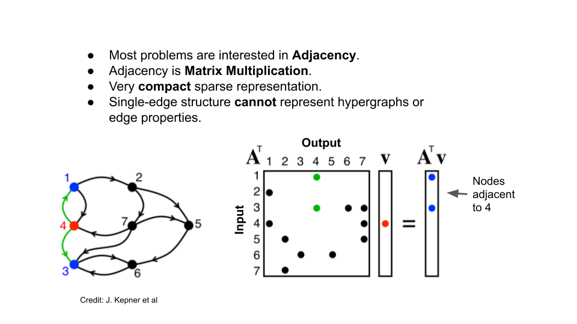

Adjacency matrices can represent simple directed and undirected graphs between identical kinds of things. The bitcoin graph, however, is a many-to-many combination of inputs and outputs to transactions, the inputs being the outputs of previous transactions. Bitcoin is actually a [Hypergraph](https://en.wikipedia.org/wiki/Hypergraph) and can be constructed using two [Incidence Matrices](https://en.wikipedia.org/wiki/Incidence_matrix).

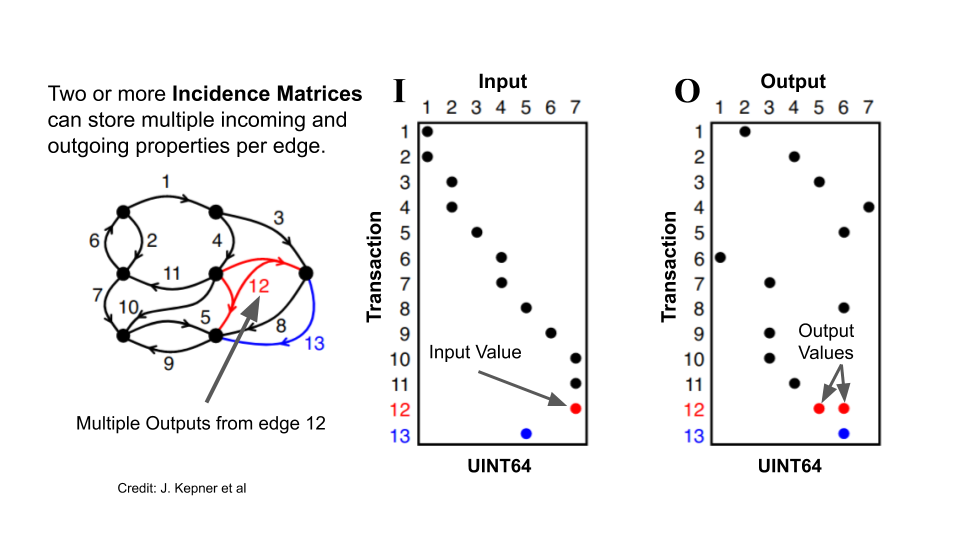

Incidence, however, now requires two steps to get from one vertex to another, but no worries, incidence matrices can be *projected* to an adjacency matrix using, you guessed it, Matrix Multiplication:

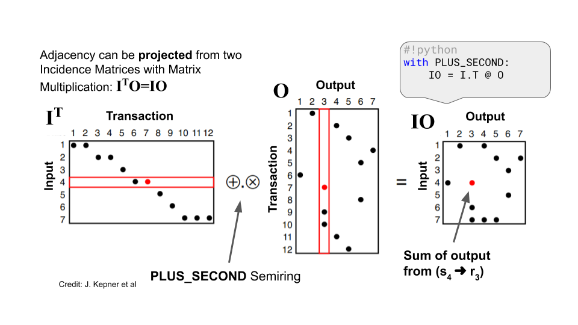

# Blocktime Addressing of Blocks, Transactions, and Outputs

The bitcoin blockchain is an immutable record of past transactions. This immutability confers onto it a *total order* of blocks, transactions, and outputs. This order is exploited by CoinBLAS by storing the rows and columns of matrices *in the same immutable order*. For the purposes of CoinBLAS, this order is called "Blocktime," not to be confused with the concept of how long it takes for the network to produce new blocks often referred to as Block Time, which isn't very interesting in this context so I'm repurposing the word.

Matrices are two-dimensional and typically have dimensions denoted by "M by N". Each value has a row and column index into the matrix within the "keyspace" of *M by N*. By convention in GraphBLAS these indexes are called `I` and `J`. The `I` index can be thought of as the id of the start of the edge, and the `J` id of the end. In SuiteSparse these values are 60-bit unsigned integers. The maximum index is the extension constant `GxB_INDEX_MAX` which is 2 to the 60th power (1152921504606846976) for SuiteSparse.

GraphBLAS has a cool trick where you can use the whole `2**60` keyspace: because matrices are *sparse* they only allocate enough memory to store their elements. The MxN are just guardrails to keep you from going "out of bounds" on your problem, but you can make a matrix that is effectively "unbounded" by setting M and N to `GxB_INDEX_MAX`. SuiteSparse won't allocate a zillion entries, it won't allocate anything in fact until you put stuff in it.

In a sense, this turns a GraphBLAS matrix into an [Associative Array](https://en.wikipedia.org/wiki/Associative_array) which was by design, of course.

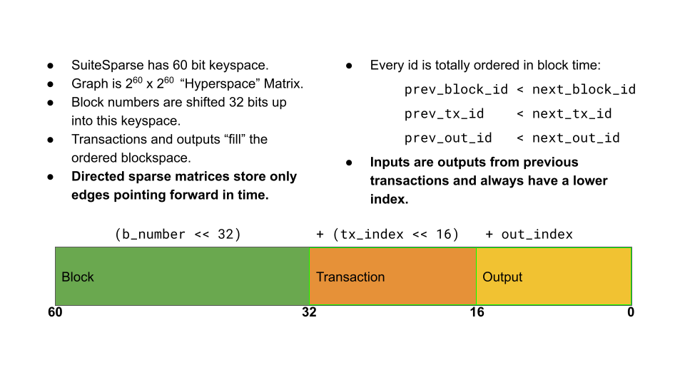

Using blocktime encoding causes the structure of the Input to Output graph to have edges that always point towards the future. Inputs can only be outputs of previous transactions (or coinbase that come "from" the block). This forms a [Directed Acyclic Graph](https://en.wikipedia.org/wiki/Directed_acyclic_graph) that forms an Upper [Triangular Matrix](https://en.wikipedia.org/wiki/Triangular_matrix):

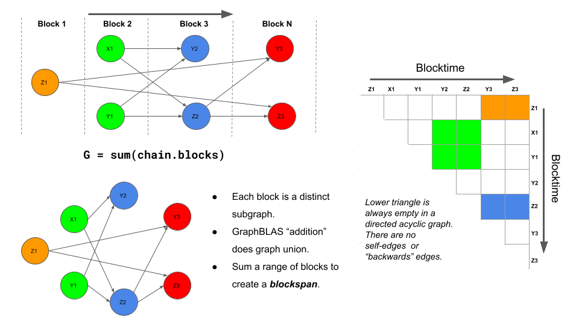

Now that we have a way of determining the order of blockchain events and constructing directed graphs, we can define the entities that are used to build up Matrix graphs in memory. These "dimensions" are the various types of conceptual vertices that can be related to each other.

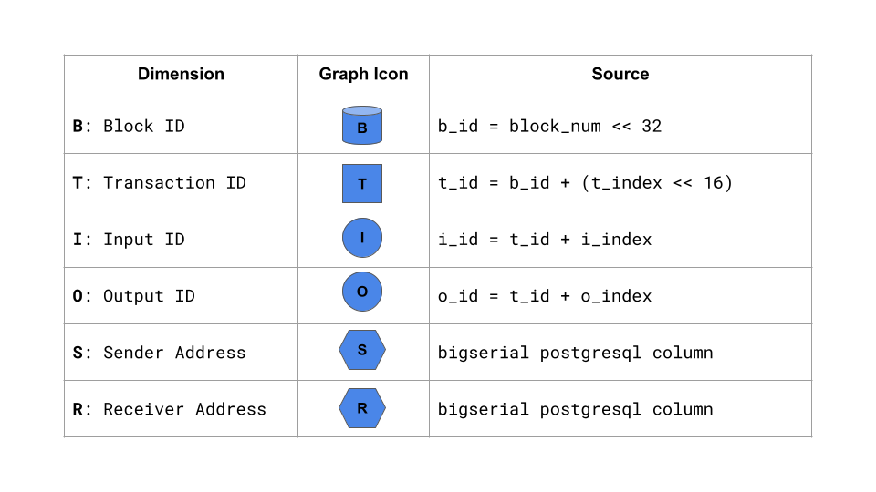

Each of the above entities is used in the incidence matrices below. These attributes of the `Chain` object are "lazy" and are only computed if they are accessed.

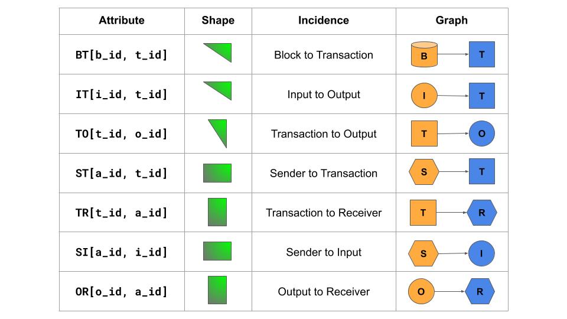

Additional adjacency projections are provided in the next table, and as you'll see below, new adjacencies are easily constructed by multiplying different combinations of incidence matrices and semirings:

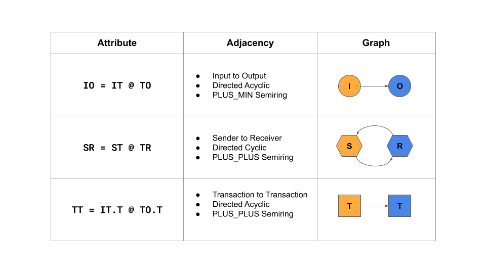

By encoding the block number, transaction index, and output index into the key used to store elements, CoinBLAS stores graphs in a linear fashion, new blocks are always appended onto the "end" of the matrix. Each block is a 2**32 "space" to fill with transactions and outputs, whose ids are always between the start of the current block and the start of the next.

This time linear construction defines a way of encoding the matrix position of blocks, transactions, and outputs in "block time" so to speak, let's see how to store the bitcoin graph as incidence matrices. A bitcoin transaction can have multiple inputs and outputs. The inputs are the outputs of previous transactions. So our incidence matrices will map "Input to Transaction" on one side and "Transaction to Output" on the other:

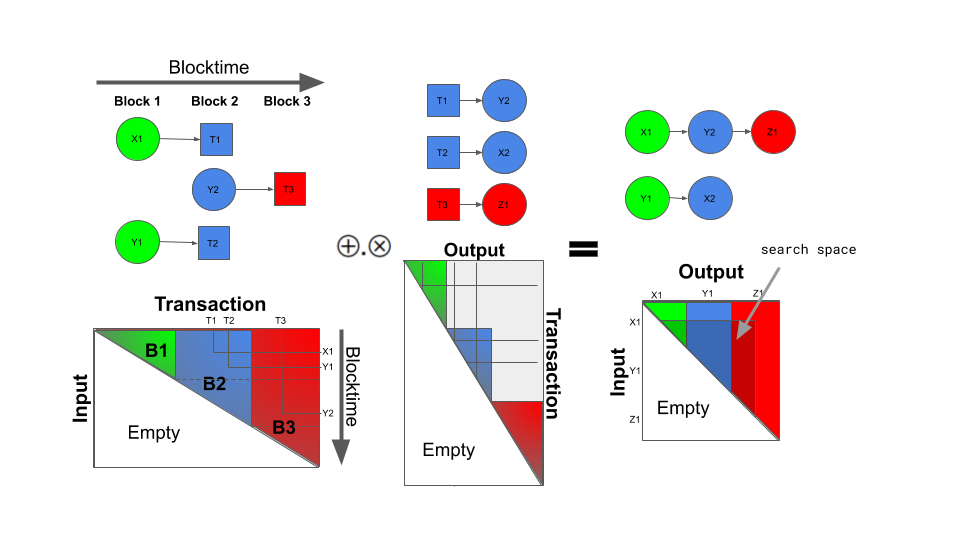

To give an idea of how the semiring works, consider a multi-party flow shown below.

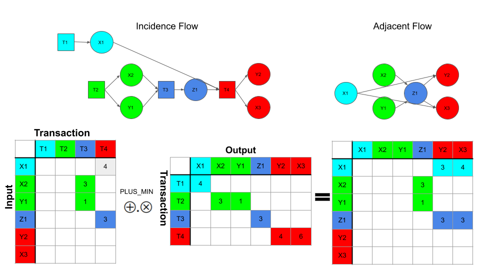

# Common Input Ownership

Any bitcoin user can make public key addresses at will, so in theory, it's hard to track back to the person who "owns" bitcoin. However, there are some heuristics for clustering objects and one of the most used heuristics is called common-input-ownership.

To create a bitcoin transaction, a wallet looks for any unspent transaction outputs to fit the transaction's value. These inputs are then used in the new transaction, publicly associating them with each other as having a common owner. Inputs of a feather spend together.

There's no end to structural and statistical techniques that can be used to cluster addresses, but common-input-ownership is one we can quickly demonstrate with CoinBLAS algebraically using the technique described by [Reid and Harrigan](https://users.encs.concordia.ca/~clark/biblio/bitcoin/Reid%202011.pdf).

We construct an ancillary network in which each vertex represents a public-key. We connect these vertices with undirected edges, where each edge joins a pair of public keys that are both inputs to the same transaction (and are thus controlled by the same user).

We'll call this new relationship "SS" for Sender to Sender. The result we want is an adjacency matrix of senders with an edge to other senders that it has shared inputs in transactions with. We can construct this adjacency by using the existing "ST" Sender to Transaction graph and matrix multiplying it by its transpose:

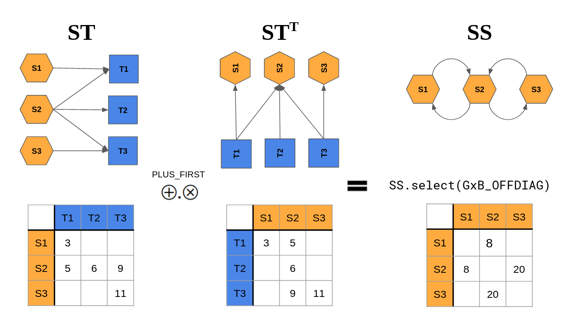

The "SS" matrix now contains a row and a column for every sender and an edge from every sender to every other sender they have shared transactions with as the sender. The `select()` function is used to remove the diagonal "self-edges" that every sender would end up with back to themselves and are uninteresting for this problem. The `PLUS_FIRST` semiring says to sum common edges between any two senders but just using the left matrix, since the values in the transpose of the matrix are redundant.

# The Future

CoinBLAS as it is today is just a starting point, a platform for advanced analysis and computation with modern, high-performance hardware. It provides a few building blocks of Bitcoin graph structure to get started. There is a whole world of complex analysis out there, and the blocks provided by CoinBLAS and sparse matrix linear algebra form the basis for an entirely new way of thinking about Graph analysis.

This is a fun diagram to get into thinking The GraphBLAS way. On the left is a diagram from a recent paper [Fast Graphlet Transform of Sparse Graphs](https://arxiv.org/abs/2007.11111) and on the right are, of course, [Lego blocks](https://en.wikipedia.org/wiki/Lego).

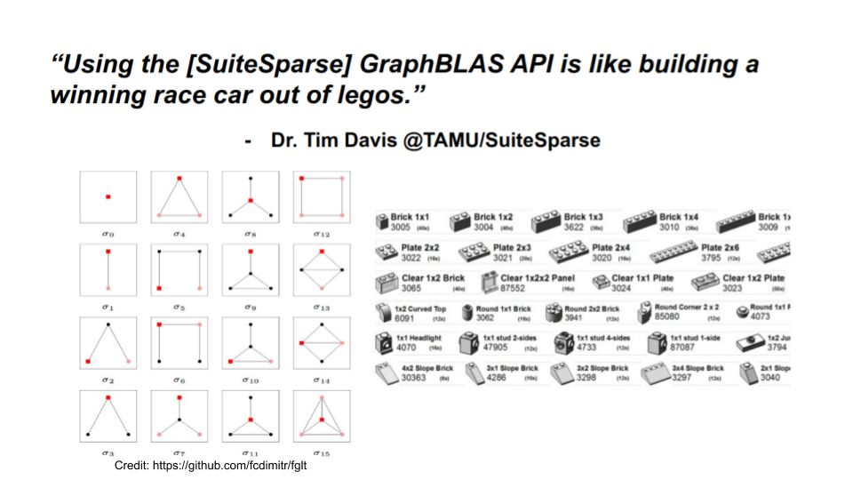

The idea here is that complex graphs can be broken down into orthogonal spectral components that describe the local structural characteristics of graphs and subgraphs. These spectral components can then form the actual data inputs to more advanced deep and statistical machine learning models. This entire body of work has been done in the language of Linear Algebra and represents an exciting new way of doing component analysis on complex graphs. Future releases of CoinBLAS will include spectral analysis functions like this.

# Ethereum

## Different Structure Same Algebra

Ethereum, unlike Bitcoin, uses an account-based model rather than a UTXO model. Each account has a balance and can send transactions directly to other accounts. Despite this difference, Ethereum's transactions still form a graph that can be represented using incidence matrices.

In Ethereum, each transaction can be seen as an edge connecting two vertices: the sender and the receiver. By constructing incidence matrices where rows represent senders and columns represent receivers, we can analyze the flow of value within the Ethereum network. This approach allows us to apply similar algebraic techniques to study transaction patterns, detect anomalies, and understand the overall structure of the Ethereum blockchain.
